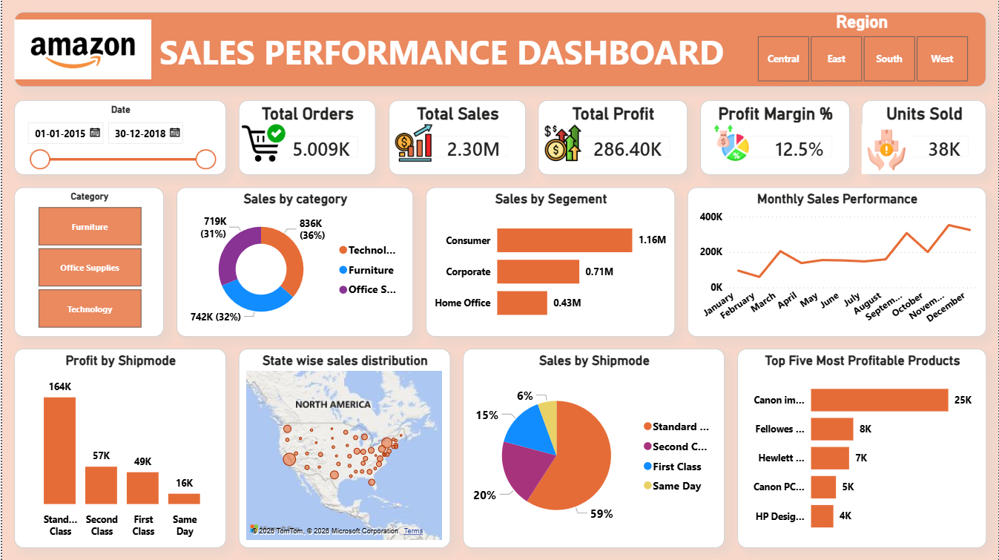

# Amazon Sales Dashboard 📊

An interactive Power BI dashboard built to analyze Amazon sales performance across products, categories, regions, and time periods. This project provides actionable insights into sales trends, profitability, and customer purchasing behavior.

---

## 🚀 Project Overview

This dashboard transforms raw order data into meaningful business insights and answers important questions such as:

- What is the total sales revenue and profit?
- Which categories and products perform the best?
- Which regions generate the highest sales?
- How do sales and profit trend over time?
- Which products contribute the most to overall revenue?

---

## 🛠️ Tools & Technologies Used

- Microsoft Power BI
- Power Query
- DAX (Data Analysis Expressions)
- Excel Dataset (`orders.xlsx`)

---

## 📌 Key KPIs

- 💰 Total Sales
- 📈 Total Profit
- 📦 Total Orders
- 🧾 Average Order Value
- 📊 Profit Margin %

---

## 📈 Dashboard Insights

- Identified top-performing product categories and sub-categories.
- Analyzed monthly sales and profit trends.
- Compared regional sales performance.
- Highlighted top-selling products.
- Evaluated category-wise profitability.

---

## 📊 Dashboard Features

- Interactive KPI Cards
- Sales Trend Analysis
- Category and Product Performance
- Regional Comparison
- Dynamic Slicers and Filters

---

## 📷 Dashboard Preview



---

## 📂 Repository Structure

```text
Amazon-Sales-Dashboard/
├── Sales_performance_dashboard.pbix
├── orders.xlsx
├── amazon_dashboard.png
└── README.md
